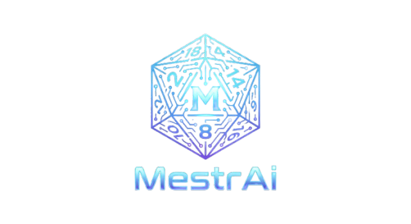

   
   

      
      
      
      
      
      
   

## Sobre
MestrAi é um VTT (Virtual Tabletop) narrado por IA com sistema narrativo deterministico, multiplayer, turnos e geração de imagens. Cada jogador usa sua própria chave da IA, mantendo custos e controle individual.

## Funcionalidades
- Campanhas com criação guiada (mundo, estilo visual e personagem).
- Multiplayer com aprovação de entrada e atualizações em tempo real.
- Turnos baseados em Destreza (sistema unificado).
- Narrativa com IA e geração de imagens.
- Sistema unificado com atributos VIGOR, DESTREZA, MENTE, PRESENCA.
- Vida por tiers (Saudavel, Machucado, Critico) com regra de 3 golpes.
- Persistência completa de mensagens e eventos.

## Stack
- Next.js (App Router)
- React + TypeScript
- Supabase (Auth, Realtime, DB)
- Tailwind CSS
- OpenRouter API

## Requisitos
- Node.js 18+
- Projeto Supabase configurado
- Chave OpenRouter por jogador (BYOK)

## Variáveis de ambiente
Crie um arquivo .env com:
- NEXT_PUBLIC_SUPABASE_URL
- NEXT_PUBLIC_SUPABASE_ANON_KEY
- SUPABASE_SERVICE_ROLE_KEY
- POLLINATIONS_KEY (opcional)

## Como obter a chave OpenRouter
1. Acesse https://openrouter.ai/keys
2. Clique em "Create Key".
3. Copie a chave gerada e configure no app (cada jogador usa sua própria chave).

## Modelos OpenRouter usados
### Pool do Mestre
- meta-llama/llama-3.3-70b-instruct:free
- openai/gpt-oss-120b:free
- qwen/qwen3-next-80b-a3b-instruct:free
- openrouter/free

### Pool Rápido
- meta-llama/llama-3.1-8b-instruct:free
- google/gemma-2-9b-it:free
- openrouter/free

## Rate limits
Os limites variam por modelo e plano. Em caso de limite atingido, a API responde com HTTP 429 e pode incluir o header `retry-after`, além de `x-ratelimit-*`.
Referência: https://openrouter.ai/docs/rate-limits

## Como rodar localmente
1. Instale as dependências: npm install
2. Configure o .env
3. Execute: npm run dev

## Scripts
- npm run dev
- npm run build
- npm run start

## Licença
Este projeto está sob a licença MIT. Veja a [LICENSE](LICENSE).

## Autor
[ Júnior Silva](https://github.com/jrchakalo)
